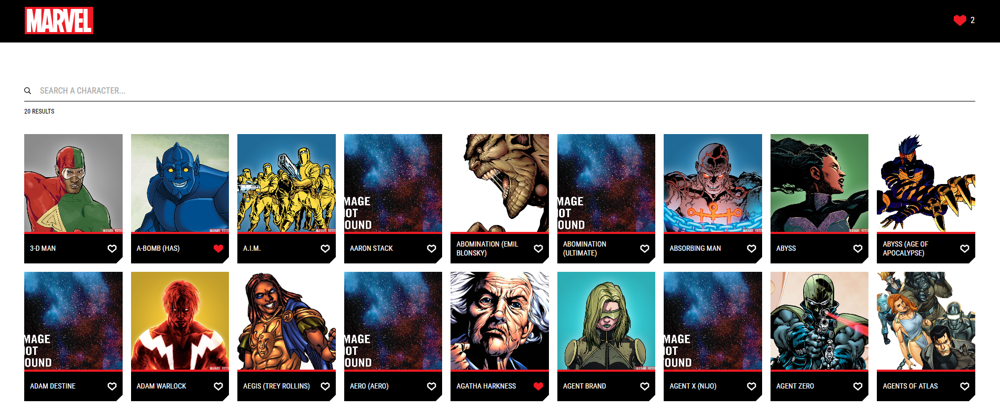
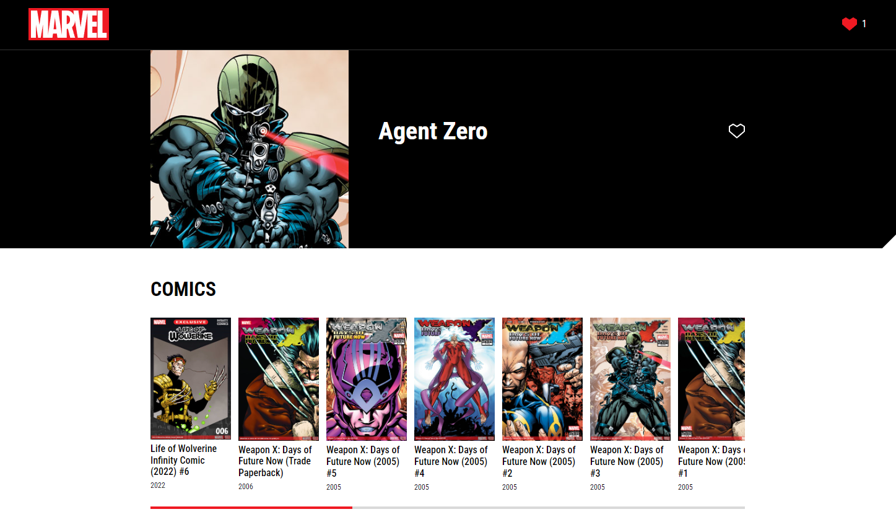

<h1 align="center">ZARA WEB CHALLENGE</h1>

</br>
<div align="center">
<div style="display: flex; justify-content: center; ">



<div style="margin-left:20px;">

</div>
</div>
</div>

## Introducción

Este proyecto es una aplicación web diseñada para obtener información sobre diferentes personajes de Marvel. Está desarrollada utilizando React Hooks, TypeScript, SASS, Context API, Vitest y Vite, y es compatible con Node.js versión 20.16.0.

## 🔬 Estructura del Proyecto

La aplicación cuenta con dos vistas principales:

1. Vista Principal

   - Muestra un listado de 50 personajes o el resultado de los personajes introducidos en el buscador.
   - Incluye un icono para mostrar los personajes favoritos almacenados.

2. Detalle de Personaje

   - Proporciona información detallada sobre el personaje y los cómics en los que aparece.

El diseño es responsive y sigue las maquetas proporcionadas en Figma.

No se ha utilizado ninguna librería de componentes externa como Ant Design, Reactstrap, Material-UI, etc. Todos los componentes están construidos desde cero.

Se han utilizado linters y formatters para mantener la calidad del código.

⚠️ ¡ATENCIÓN! ⚠️ Debido a problemas con tiempos de respuesta excesivamente largos en la API de Marvel, he creado esta versión que carga los personajes de 5 en 5 hasta llegar a un máximo de 50 personajes, como se solicita en el enunciado. Lo mismo aplica para las búsquedas de personajes y la visualización de los cómics, este último hasta un máximo de 20 cómics.

Además, para mejorar la experiencia del usuario, los datos devueltos por la API son cacheados hasta la siguiente renderización de la web.

## 📐 Arquitectura

- **public**: Archivos estáticos para el despliegue.
- **src**: Contiene todo el código fuente de la aplicación:

  - **pages**: Vistas principales de la aplicación.
  - **components**: Componentes reutilizables.
  - **context**: Contextos para la gestión del estado global.
  - **hooks**: Custom hooks para el principio de responsabilidad única.
  - **utils**: Funciones helpers comunes optimizadas para todo el proyecto.
  - **styles**: Estilos globales y uso de variables.
  - **tests**: Pruebas unitarias y de integración usando Vitest y React Testing Library.
  - **assets**: Iconos utilizados en el diseño.

## 🔨 Instalación y Configuración

### 1. Clona el Repositorio

```bash
git clone https://github.com/IgnaLog/zarawebchallenge.git
cd zarawebchallenge
```

### 2. Instala las Dependencias

Asegúrate de tener Node.js 20.16.0 instalado. Luego, ejecuta:

```bash
npm install
```

### 3. Configuración del Entorno

Crea un archivo .env en la raíz del proyecto y añade tus claves de API de Marvel:

```bash
VITE_MARVEL_PUBLIC_KEY=tu_clave_publica_de_api
VITE_MARVEL_PRIVATE_KEY=tu_clave_privada_de_api
VITE_BASE_URL=https://gateway.marvel.com/v1/public/characters
```

### 4. Ejecutar la Aplicación

#### Modo Desarrollo

Para iniciar el entorno de desarrollo, ejecuta:

```bash
npm run dev
```

Esto iniciará un servidor de desarrollo en http://localhost:5173/, donde podrás ver la aplicación en modo no minimizado.

#### Modo Producción

Para crear una versión de producción de la aplicación, ejecuta:

```bash
npm run build
```

Luego, puedes servir los archivos generados en la carpeta _dist_ con un servidor estático como serve:

```bash
npm install -g serve
serve -s dist
```

Esto servirá los archivos en modo producción, con los assets concatenados y minimizados.

## 🧪 Testing

Para ejecutar las pruebas, usa:

```bash
npm run test
```

Esto ejecutará Vitest para comprobar que todas las pruebas pasen correctamente.

## 🚀 Despliegue

La aplicación está desplegada en Vercel y se puede acceder a través del siguiente enlace:

```bash
https://zarawebchallenge.vercel.app/
```
